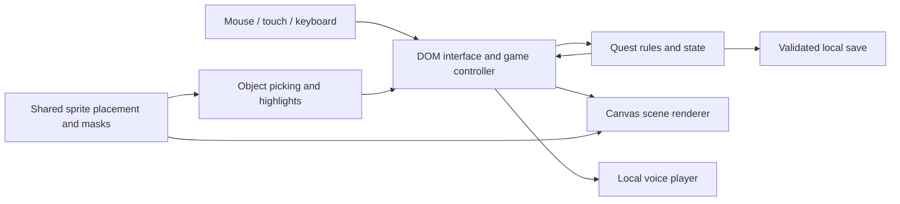

# Build a small adventure game with coding agents

This guide explains the process behind **Full Throttle: Байк обреченный** and turns it into a workflow you can adapt. The useful unit of progress was a playable, reviewed change: a working puzzle, a better sprite, a stable dialogue panel, or a verified deployment.

A coding agent can write and run code, help organize assets, and investigate failures. A human still defines the experience, judges visual and audio quality, chooses which changes to keep, and plays the game. Frequent concrete feedback was a central part of this project.

The instructions below work with an agent that can edit a repository and run commands. Browser inspection and image or speech generation are useful additional capabilities. Tool availability varies; record what was actually available in your own experiment.

## 1. Define a game small enough to finish

Write down the player goal, available actions, locations, ending, target language, and delivery format. Four locations with a connected puzzle chain provide plenty of interaction to test without requiring a large content pipeline.

Give the agent observable acceptance criteria. Here is a starting brief you can adapt:

```text
Build a complete browser point-and-click adventure in this repository.

The player repairs a motorcycle and uncovers a conspiracy across four
locations. Define a complete puzzle chain and an ending. Include looking,
using items, talking, contextual actions, an inventory, a journal, and hints.

Use Russian for player-facing text. Support mouse, touch, and keyboard.
Save locally and provide JSON save export/import. Wrong actions must not
destroy essential items or make the game impossible to finish.

Use JavaScript modules, HTML/CSS for accessible UI, and canvas for the scene.
The deployed game must be a static site with relative asset paths, local
assets, and no runtime API keys or backend.

Start with a playable version using simple temporary art. Separate game
rules from rendering. Test a full route to the ending and save/reload after
each milestone. Run appropriate checks and commit completed checkpoints.
```

Choose a setting and visual references intentionally. For a new game, establish its own characters, places, dialogue, and asset provenance. References can guide palette, composition, materials, and atmosphere without becoming the game's source files.

## 2. Build the rules before polishing the art

Describe the puzzle dependencies before implementing their presentation. For example, a repaired vehicle may require three independently collectable parts; entering the final location may require the repair. Ask the agent to identify every item or flag needed to reach the ending and check for circular dependencies.

Then build one complete interaction: an object, an action, a state change, a visible response, and a save. Extend that working path until the ending is reachable.

```text
Implement the complete quest state and action rules first. Keep them usable
without the DOM, canvas, or audio. Add a test that reaches the ending through
real player actions, serializing and reloading state after every milestone.
Also try collecting independent repair items in different orders.
```

In this repository, [engine.js](../src/engine.js) contains the rules and save validation. [engine.test.mjs](../tests/engine.test.mjs) exercises actual actions and checks alternative puzzle orders, prerequisite gates, invalid combinations, and save recovery.

The state is mutable, but its rules are isolated from browser presentation. This makes it possible to investigate a puzzle failure without reproducing every mouse movement.

## 3. Keep responsibilities clear

The implementation uses plain JavaScript modules and no npm dependencies. That made this particular static game straightforward to inspect and deploy. Choose your own stack according to the game's needs; a different genre may benefit from a dedicated engine.



| Responsibility | This project's implementation | Why the boundary helps |
| --- | --- | --- |
| Rules and persistence | `src/engine.js` | Tests can play the quest without a browser. |
| UI integration | `src/game.js` | DOM events turn into rule calls and visible feedback. |
| Rendering | `src/art.js` | Drawing changes do not need to rewrite puzzles. |
| Object placement | `src/scene-layout.js` | Drawing and interaction share the same geometry. |
| Picking and highlighting | `src/highlight.js`, `src/scenery-masks.js` | Transparent gaps behave consistently. |
| Animation | `src/walk-cycle.js` | Motion can be tested independently of frame rate. |
| Speech playback | `src/voice-player.js` | Cancellation, replay, and save history have explicit behavior. |
| Opening | `src/intro.js` | The intro can pause, finish, and return control without changing quest progress. |

Keep the smallest useful boundary rather than splitting every function into a new subsystem. Here, several modules are deliberately compact. If expanding the game substantially, the large rules and UI modules are natural candidates for further organization.

## 4. Generate assets with an implementation contract

Once the game works, replace temporary visuals with assets that have specified dimensions, framing, and roles. Generate backgrounds, characters, collectible items, and changing object states separately.

An example background prompt:

```text
Paint a desert motorcycle workshop for a 1990s adventure game: warm sunset,
inked silhouettes, rusted machinery, readable depth, and detailed materials.
Use a 1536 x 1024 canvas. Leave a clear walking strip near the bottom and
space for a mechanic near the workbench. No lettering or interface panels.
Do not paint the collectible radio or removable motorcycle parts into the
background; those will be separate sprites.
```

An example prop prompt:

```text
Create a detailed chrome motorcycle fork as an isolated PNG cutout. Match
the supplied workshop reference's lighting and painted style. Keep the
entire object visible with padding. The space between the fork legs must
be transparent, as must the outer background. No ground plane or lettering.
```

Verify the actual alpha channel. A checkerboard painted into an opaque image is not transparency. Inspect the sprite at game size: details that look impressive in a large source image may disappear after scaling.

For a changing object, list its visual states up front. The cabinet in this game has closed, open, and powered frames sharing one placement. For walking, keep the character's scale and boot baseline consistent across frames, and drive frame changes from distance traveled. Otherwise the character can wobble or slide.

Record asset sources, tool/model identifiers when supplied, prompts, accepted versions, and licenses in your own development records. This public repository bundles final assets and a concise [provenance summary](../CREDITS.md); generation logs and provider configuration are not required to run it.

## 5. Make interaction follow the artwork

A transparent sprite should not act like an opaque rectangle. Reuse its alpha mask for both object selection and its highlight. For an object painted into the scenery, derive a deliberate mask from the actual image and keep it aligned with the renderer.

```text
The wreck's highlight does not follow the visible body and wheels. Inspect
the actual artwork and fix the mask. Picking and highlighting must use the
same geometry, including the empty gaps. Verify the normal scene size and
fullscreen, and keep the highlight soft enough to preserve surface detail.
```

When an item is taken, update its sprite, available interaction targets, inventory state, and restored-save behavior together. A fork still painted into the background will remain visible even if its hotspot is correctly removed.

Useful checks from this project include transparent holes, sprite bounds, masks at different scales, and the absence of a collected object after reloading. See [scenery-masks.test.mjs](../tests/scenery-masks.test.mjs) and [inventory-cursor.test.mjs](../tests/inventory-cursor.test.mjs).

## 6. Review the interface in the running game

Ask for a specific flow and an expected result, then inspect it at desktop, portrait-phone, and landscape-phone sizes. A passing unit test cannot establish that the title is readable or the controls fit.

Examples of useful feedback from this kind of iteration:

- “Keep the dialogue panel the same height when reply choices appear.”
- “Make both title buttons the same width and height.”
- “Group intro controls together; sound and pause should be icons.”
- “Show the selected inventory item's image as the cursor over the scene.”
- “Use a more expressive title font, while keeping Russian dialogue readable.”

The resulting implementation should preserve accessible button names, visible keyboard focus, sufficiently large touch targets, and a clear return path from dialogs and the intro.

Give the agent a small verification loop:

```text
Reproduce the reported layout issue in the saved-game title screen. Make
the smallest useful change. Check desktop and a narrow phone viewport,
exercise both buttons, inspect console errors, and show the resulting
screenshot. Run the relevant checks and commit the completed fix.
If browser inspection is unavailable, state that limitation explicitly.
```

In this project, narrowing the title typography needed a separate landscape adjustment. Removing the intro's manual-next button also required revisiting reduced-motion behavior: still images now advance automatically, with pause available. Review the behavioral dependencies of a visual change.

## 7. Add prerecorded speech after the text settles

Start with three or four short samples. Give each character a stable voice identity and a distinct delivery profile. Listen before generating the full catalogue; text descriptions of “gruff” or “fast” are not a substitute for checking the recordings.

Treat these as separate inputs:

- **Voice identity:** the recurring speaker's timbre.
- **Delivery profile:** habitual pace, rhythm, and intonation.
- **Line direction:** the situation and emotion of one particular utterance.

Generate recordings outside the browser. Keep provider credentials in your private environment or credential store, and keep generation configuration out of the deployable site. Cache matching generations so an unchanged line does not incur another request. Review model and provider behavior against their documentation when implementing your own generator.

The runtime only needs a catalogue mapping stable IDs and dialogue text to local audio files. This game's [voice catalogue](../src/voice-samples.js) also records hashes for cache invalidation. The voice player cancels old audio when dialogue changes, ducks music while speech is active, and retains text if playback fails.

Track a line as heard when playback actually starts. A failed, muted, or cancelled attempt should not consume the first automatic playback. A manual replay button gives the player control over repeated lines. Test late audio callbacks: an old request must never stop a newer line or mark a new playthrough as heard.

The public project ships 236 final WAV files. It intentionally has no speech-generation command; use your own provider setup if you want to author new speech.

## 8. Use checkpoints that can be inspected and reversed

Finish a bounded change, run relevant checks, inspect the result, and commit it. A useful sequence is:

1. A complete playable quest using temporary art.
2. Final scene composition and object interaction.
3. Walking, responsive UI, and keyboard/touch handling.
4. Approved speech samples, then complete speech coverage.
5. Intro, visual polish, and fixes from playtesting.
6. A clean public build, documentation, and deployment.

Keep a concise development record of important feedback and accepted decisions. Update superseded decisions so the agent does not restore an earlier design. Publish a readable explanation of the process rather than private chats, provider receipts, or personal workspace details.

Ask agents to report what changed, how it was checked, and what remains unverified. Use the diff, test output, screenshots, audio review, and playable result as evidence. A confident completion message is not itself a verification artifact.

## 9. Test game behavior and release behavior

Run the repository's checks:

```sh
npm test
npm run check
npm run build
npm run preview -- --base /full_throttle/
```

The tests cover complete quest progression, saves, alternative orders, rejected actions, localization, object geometry, walking, intro timing, audio cancellation/replay, and publication boundaries. The HTTP tests request all final recordings and compare their hashes, including when the game is hosted under a repository subpath.

For manual playtesting, exercise a fresh start, saved-game continuation, intro skip/pause/replay, the full puzzle route, map/journal/hints, sound, fullscreen, and a narrow phone layout. Inspect browser console errors and missing asset requests. Check at least one long conversation with several answer choices.

For this public export, the automated suite and HTTP checks were run locally. The in-app browser connection was unavailable, so this export does not add a new live visual verification claim. Readers can repeat the manual checks on the deployed game.

## 10. Prepare a public repository deliberately

Copy reviewed runtime files into a clean repository. Include the source, final assets, runtime tests, a useful README, and necessary licenses. Keep local tokens, generator scripts, raw generation records, internal logs, and obsolete comparison files outside it.

This project's [site manifest](../scripts/site-files.mjs) names every deployable file. [The build](../scripts/build.mjs) validates those paths, recreates `dist/`, and copies only the listed files. Tests verify that a stale file in the old output does not survive the next build. Adding a new runtime module or asset requires updating the manifest.

The [Pages workflow](../.github/workflows/pages.yml) runs checks on pull requests and deploys `main`. Follow the [README deployment steps](../README.md#deploy-your-copy-on-github-pages). The public site needs no service credentials; GitHub's deployment environment supplies the Pages permissions.

## Experiments for researchers and LLM enthusiasts

Use a small, fixed game brief to compare development workflows. Decide what you will measure before running the comparison, and keep the environment, assets, acceptance tests, and human feedback policy consistent.

| Question | Suggested experiment | Evidence to collect |
| --- | --- | --- |
| Does planning the quest first reduce broken progressions? | Compare a dependency-plan stage with immediate implementation. | Passed quest invariants, soft-locks found, corrective iterations. |
| Does visual feedback improve interaction accuracy? | Compare written reports with reports that include the same scene screenshot. | Missed targets and erroneous selections on a fixed set of pointer coordinates. |
| Do shared geometry modules reduce regressions? | Compare shared placement/masks with independently maintained coordinates. | Failures after the same viewport and sprite changes. |
| Do checkpoints help recover from a bad change? | Apply the same deliberately troublesome feature request to checkpointed and uncheckpointed runs. | Recovery steps, unrelated changes, and restored tests. |
| Does approving voice samples first reduce rework? | Compare small-sample review with immediate full-catalogue generation. | Regenerated lines, listening judgments, and recorded provider usage. |

Record the commit, model and tool versions when known, prompts, permitted actions, number of human interventions, test results, and actual resource usage when available. Repeat trials and report variation. Distinguish measured results from your interpretation of them.

This repository is a case study, not a benchmark dataset: it does not include a complete interaction trace, controlled comparison runs, or verified totals for generation cost and agent time. Its code, assets, and tests let you reproduce the finished game's behavior from a commit. Fresh image and speech generations may differ even when their prompts are similar.

For your own study, use [GitHub's Pages workflow documentation](https://docs.github.com/en/pages/getting-started-with-github-pages/using-custom-workflows-with-github-pages) for deployment and [the included source/tests](../README.md#study-the-implementation) as concrete implementation examples.
